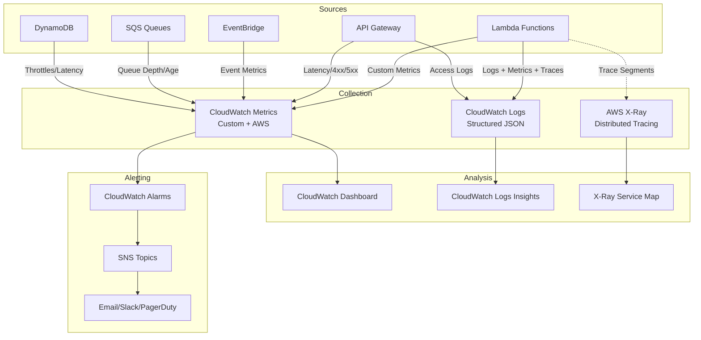

#### Overview

Monitoring is **CRITICAL** for production systems. In this step, you will set up a complete observability stack for the Smart Campus Platform:
- CloudWatch Logs aggregation with structured JSON logging
- Custom metrics for business KPIs
- A CloudWatch Dashboard overview
- Alarms for critical events (DLQ, Error rate, Latency, Throttles)
- **AWS X-Ray Distributed Tracing** (essential for serverless debugging)

#### Why Do We Need Monitoring?

**Without monitoring:**
- ❌ You don't know when the system fails
- ❌ You can't detect performance degradation
- ❌ You can't track usage patterns
- ❌ Debugging is extremely difficult when issues arise

**With monitoring:**
- ✅ Detect failures in real-time
- ✅ Automatic alerts when thresholds are exceeded
- ✅ Analyze trends and patterns
- ✅ Debug quickly with detailed logs + distributed traces

#### Monitoring Architecture (Observability Stack)



#### Step 1: Create CloudWatch Log Groups

**Lambda logs (auto-created, but verify):**
```bash
aws logs describe-log-groups \
  --log-group-name-prefix /aws/lambda/smart-campus \
  --region ap-southeast-1
```

Expected:
```
/aws/lambda/smart-campus-api
/aws/lambda/smart-campus-analytics-worker
/aws/lambda/smart-campus-notification-worker
/aws/lambda/smart-campus-tasks-overdue-checker
```

**API Gateway logs (created in step 6):**
```bash
aws logs describe-log-groups \
  --log-group-name-prefix /aws/apigateway/smart-campus \
  --region ap-southeast-1
```

**Application logs (custom):**
```bash
aws logs create-log-group \
  --log-group-name /smart-campus/application \
  --region ap-southeast-1

# Set retention (30 days)
aws logs put-retention-policy \
  --log-group-name /smart-campus/application \
  --retention-in-days 30 \
  --region ap-southeast-1
```

**EventBridge logs:**
```bash
aws logs create-log-group \
  --log-group-name /aws/events/smart-campus \
  --region ap-southeast-1

aws logs put-retention-policy \
  --log-group-name /aws/events/smart-campus \
  --retention-in-days 30 \
  --region ap-southeast-1
```

#### Step 2: Set Up Structured JSON Logging (Best Practice)

**app/core/logger.py:**
```python
# app/core/logger.py
import json
import logging
from datetime import datetime

class JSONFormatter(logging.Formatter):
    def format(self, record):
        log_data = {
            'timestamp': datetime.utcnow().isoformat(),
            'level': record.levelname,
            'logger': record.name,
            'message': record.getMessage(),
            'function': record.funcName,
            'line': record.lineno
        }
        
        # Add exception info if present
        if record.exc_info:
            log_data['exception'] = self.formatException(record.exc_info)
        
        # Add custom fields from extra
        for key, value in record.__dict__.items():
            if key not in ['name', 'msg', 'args', 'created', 'filename', 'funcName',
                          'levelname', 'levelno', 'lineno', 'module', 'msecs',
                          'message', 'pathname', 'process', 'processName',
                          'relativeCreated', 'thread', 'threadName', 'exc_info',
                          'exc_text', 'stack_info', 'getMessage']:
                log_data[key] = value
        
        return json.dumps(log_data, ensure_ascii=False)

# Configure root logger
def setup_logger(name='smart-campus'):
    logger = logging.getLogger(name)
    logger.setLevel(logging.INFO)
    
    if not logger.handlers:
        handler = logging.StreamHandler()
        handler.setFormatter(JSONFormatter())
        logger.addHandler(handler)
    
    return logger

logger = setup_logger()
```

**Usage in code:**
```python
from app.core.logger import logger

# Basic log
logger.info("User logged in")

# Log with business context (extra fields)
logger.info("Attendance recorded", extra={
    'user_id': 'user-001',
    'request_id': 'req-123',
    'attendance_id': 'att-abc123',
    'status': 'PRESENT',
    'session_type': 'MORNING',
    'confidence': 98.5,
    'camera_id': 'camera-01'
})

# Log error with full context
try:
    result = recognize_face(image)
except Exception as e:
    logger.error("Face recognition failed", exc_info=True, extra={
        'user_id': user_id,
        'error_type': type(e).__name__,
        'camera_id': camera_id,
        'image_size_bytes': len(image_base64)
    })
```

#### Step 3: Enable AWS X-Ray Distributed Tracing

**1. Install the X-Ray SDK:**
```bash
# requirements.txt
aws-xray-sdk==2.12.1
```

**2. Patch all libraries (app/main.py):**
```python
# app/main.py - FIRST LINES before any imports
from aws_xray_sdk.core import xray_recorder
from aws_xray_sdk.core import patch_all

# Patch all supported libraries (boto3, requests, sqlite3, etc.)
patch_all()

# Configure X-Ray recorder
xray_recorder.configure(
    service='smart-campus-api',
    sampling=False,  # Disable sampling for dev, enable for prod
    context_missing='LOG_ERROR'
)

# Now import other modules
from fastapi import FastAPI
# ... rest of imports
```

**3. Add X-Ray middleware for FastAPI:**
```python
# app/core/xray_middleware.py
from aws_xray_sdk.ext.flask.middleware import XRayMiddleware
# For FastAPI, use manual segment management

from aws_xray_sdk.core import xray_recorder
from starlette.middleware.base import BaseHTTPMiddleware

class XRayMiddleware(BaseHTTPMiddleware):
    async def dispatch(self, request, call_next):
        # Start segment
        xray_recorder.begin_segment('smart-campus-api')
        
        # Add request annotations
        xray_recorder.put_annotation('http.method', request.method)
        xray_recorder.put_annotation('http.url', str(request.url))
        
        try:
            response = await call_next(request)
            xray_recorder.put_annotation('http.status', response.status_code)
            return response
        except Exception as e:
            xray_recorder.put_annotation('error', True)
            xray_recorder.put_metadata('exception', str(e))
            raise
        finally:
            xray_recorder.end_segment()

# Add to app
app.add_middleware(XRayMiddleware)
```

**4. IAM Permissions for X-Ray (Lambda role):**
```json
{
  "Sid": "XRayAccess",
  "Effect": "Allow",
  "Action": [
    "xray:PutTraceSegments",
    "xray:PutTelemetryRecords",
    "xray:GetSamplingRules",
    "xray:GetSamplingTargets"
  ],
  "Resource": "*"
}
```

#### Step 4: Create CloudWatch Metric Filters (Business KPIs)

**Metric 1: Attendance Success Rate**
```bash
# Filter pattern for successful attendance
aws logs put-metric-filter \
  --log-group-name /aws/lambda/smart-campus-api \
  --filter-name AttendanceSuccess \
  --filter-pattern '{ $.status = "PRESENT" || $.status = "LATE" }' \
  --metric-transformations \
    metricName=AttendanceSuccess,metricNamespace=SmartCampus,metricValue=1 \
  --region ap-southeast-1
```

**Metric 2: Liveness Check Failures (Security)**
```bash
aws logs put-metric-filter \
  --log-group-name /aws/lambda/smart-campus-api \
  --filter-name LivenessFailure \
  --filter-pattern '{ $.error = "Liveness check failed" }' \
  --metric-transformations \
    metricName=LivenessFailure,metricNamespace=SmartCampus,metricValue=1 \
  --region ap-southeast-1
```

**Metric 3: Unknown Face Detected (Security)**
```bash
aws logs put-metric-filter \
  --log-group-name /aws/lambda/smart-campus-api \
  --filter-name UnknownFace \
  --filter-pattern '{ $.error = "Unknown face" }' \
  --metric-transformations \
    metricName=UnknownFace,metricNamespace=SmartCampus,metricValue=1 \
  --region ap-southeast-1
```

**Metric 4: Lambda Errors**
```bash
aws logs put-metric-filter \
  --log-group-name /aws/lambda/smart-campus-api \
  --filter-name LambdaErrors \
  --filter-pattern 'ERROR' \
  --metric-transformations \
    metricName=LambdaErrors,metricNamespace=SmartCampus,metricValue=1 \
  --region ap-southeast-1
```

**Metric 5: SQS DLQ Messages (Critical)**
```bash
aws logs put-metric-filter \
  --log-group-name /aws/lambda/smart-campus-analytics-worker \
  --filter-name DLQMessages \
  --filter-pattern '{ $.eventSource = "aws:sqs" && $.eventSourceARN = "*dlq*" }' \
  --metric-transformations \
    metricName=DLQMessages,metricNamespace=SmartCampus,metricValue=1 \
  --region ap-southeast-1
```

#### Step 5: Create CloudWatch Alarms

**Alarm 1: High Error Rate**
```bash
aws cloudwatch put-metric-alarm \
  --alarm-name SmartCampus-HighErrorRate \
  --alarm-description "Lambda error rate > 5% in 5 minutes" \
  --metric-name LambdaErrors \
  --namespace SmartCampus \
  --statistic Sum \
  --period 300 \
  --evaluation-periods 1 \
  --threshold 5 \
  --comparison-operator GreaterThanThreshold \
  --alarm-actions arn:aws:sns:ap-southeast-1:${AWS_ACCOUNT_ID}:smart-campus-alerts \
  --region ap-southeast-1
```

**Alarm 2: Liveness Failure Spike (Attack Detection)**
```bash
aws cloudwatch put-metric-alarm \
  --alarm-name SmartCampus-LivenessFailureSpike \
  --alarm-description "Liveness failures > 10 in 5 minutes (possible attack)" \
  --metric-name LivenessFailure \
  --namespace SmartCampus \
  --statistic Sum \
  --period 300 \
  --evaluation-periods 1 \
  --threshold 10 \
  --comparison-operator GreaterThanThreshold \
  --alarm-actions arn:aws:sns:ap-southeast-1:${AWS_ACCOUNT_ID}:smart-campus-security-alerts \
  --region ap-southeast-1
```

**Alarm 3: DLQ Messages (Data Loss Risk)**
```bash
aws cloudwatch put-metric-alarm \
  --alarm-name SmartCampus-DLQMessages \
  --alarm-description "Messages in Dead Letter Queue - immediate investigation needed" \
  --metric-name DLQMessages \
  --namespace SmartCampus \
  --statistic Sum \
  --period 60 \
  --evaluation-periods 1 \
  --threshold 1 \
  --comparison-operator GreaterThanOrEqualToThreshold \
  --alarm-actions arn:aws:sns:ap-southeast-1:${AWS_ACCOUNT_ID}:smart-campus-critical-alerts \
  --region ap-southeast-1
```

**Alarm 4: API Gateway 5xx Errors**
```bash
aws cloudwatch put-metric-alarm \
  --alarm-name SmartCampus-API5xxErrors \
  --alarm-description "API Gateway 5xx errors > 1% in 5 minutes" \
  --metric-name 5XXError \
  --namespace AWS/ApiGateway \
  --dimensions Name=ApiName,Value=smart-campus-api \
  --statistic Average \
  --period 300 \
  --evaluation-periods 1 \
  --threshold 0.01 \
  --comparison-operator GreaterThanThreshold \
  --alarm-actions arn:aws:sns:ap-southeast-1:${AWS_ACCOUNT_ID}:smart-campus-alerts \
  --region ap-southeast-1
```

**Alarm 5: Lambda Throttles (Concurrency Limit)**
```bash
aws cloudwatch put-metric-alarm \
  --alarm-name SmartCampus-LambdaThrottles \
  --alarm-description "Lambda throttles detected - concurrency limit reached" \
  --metric-name Throttles \
  --namespace AWS/Lambda \
  --dimensions Name=FunctionName,Value=smart-campus-api \
  --statistic Sum \
  --period 300 \
  --evaluation-periods 1 \
  --threshold 1 \
  --comparison-operator GreaterThanOrEqualToThreshold \
  --alarm-actions arn:aws:sns:ap-southeast-1:${AWS_ACCOUNT_ID}:smart-campus-alerts \
  --region ap-southeast-1
```

#### Step 6: Create a CloudWatch Dashboard

```bash
cat > dashboard.json <<'EOF'
{
  "widgets": [
    {
      "type": "metric",
      "x": 0, "y": 0, "width": 12, "height": 6,
      "properties": {
        "metrics": [
          ["SmartCampus", "AttendanceSuccess"],
          ["SmartCampus", "LivenessFailure"],
          ["SmartCampus", "UnknownFace"],
          ["SmartCampus", "LambdaErrors"]
        ],
        "period": 300,
        "stat": "Sum",
        "region": "ap-southeast-1",
        "title": "Business KPIs - Attendance & Security",
        "yAxis": { "left": { "min": 0 } }
      }
    },
    {
      "type": "metric",
      "x": 12, "y": 0, "width": 12, "height": 6,
      "properties": {
        "metrics": [
          ["AWS/Lambda", "Duration", "FunctionName", "smart-campus-api"],
          ["AWS/Lambda", "Invocations", "FunctionName", "smart-campus-api"],
          ["AWS/Lambda", "Errors", "FunctionName", "smart-campus-api"],
          ["AWS/Lambda", "Throttles", "FunctionName", "smart-campus-api"]
        ],
        "period": 300,
        "stat": "Average",
        "region": "ap-southeast-1",
        "title": "Lambda Performance - Main API"
      }
    },
    {
      "type": "metric",
      "x": 0, "y": 6, "width": 12, "height": 6,
      "properties": {
        "metrics": [
          ["AWS/ApiGateway", "Latency", "ApiName", "smart-campus-api"],
          ["AWS/ApiGateway", "5XXError", "ApiName", "smart-campus-api"],
          ["AWS/ApiGateway", "4XXError", "ApiName", "smart-campus-api"],
          ["AWS/ApiGateway", "Count", "ApiName", "smart-campus-api"]
        ],
        "period": 300,
        "stat": "Average",
        "region": "ap-southeast-1",
        "title": "API Gateway Metrics"
      }
    },
    {
      "type": "metric",
      "x": 12, "y": 6, "width": 12, "height": 6,
      "properties": {
        "metrics": [
          ["AWS/SQS", "ApproximateNumberOfMessagesVisible", "QueueName", "smart-campus-analytics-queue"],
          ["AWS/SQS", "ApproximateNumberOfMessagesVisible", "QueueName", "smart-campus-notification-queue"],
          ["AWS/SQS", "ApproximateAgeOfOldestMessage", "QueueName", "smart-campus-analytics-queue"],
          ["AWS/SQS", "NumberOfMessagesSent", "QueueName", "smart-campus-analytics-queue"]
        ],
        "period": 300,
        "stat": "Average",
        "region": "ap-southeast-1",
        "title": "SQS Queue Health"
      }
    },
    {
      "type": "log",
      "x": 0, "y": 12, "width": 24, "height": 8,
      "properties": {
        "query": "SOURCE '/aws/lambda/smart-campus-api' | fields @timestamp, @message\n| filter @message like /ERROR/\n| sort @timestamp desc\n| limit 20",
        "region": "ap-southeast-1",
        "title": "Recent Errors (Logs Insights)",
        "stacked": false
      }
    }
  ]
}
EOF

aws cloudwatch put-dashboard \
  --dashboard-name SmartCampus-Production \
  --dashboard-body file://dashboard.json \
  --region ap-southeast-1
```

#### Step 7: SNS Topics for Alerting

```bash
# Critical alerts (DLQ, Security)
aws sns create-topic --name smart-campus-critical-alerts --region ap-southeast-1
aws sns subscribe \
  --topic-arn arn:aws:sns:ap-southeast-1:${AWS_ACCOUNT_ID}:smart-campus-critical-alerts \
  --protocol email \
  --notification-endpoint admin@company.com \
  --region ap-southeast-1

# General alerts (Errors, Throttles, 5xx)
aws sns create-topic --name smart-campus-alerts --region ap-southeast-1
aws sns subscribe \
  --topic-arn arn:aws:sns:ap-southeast-1:${AWS_ACCOUNT_ID}:smart-campus-alerts \
  --protocol email \
  --notification-endpoint devops@company.com \
  --region ap-southeast-1

# Security alerts (Liveness, Unknown face)
aws sns create-topic --name smart-campus-security-alerts --region ap-southeast-1
aws sns subscribe \
  --topic-arn arn:aws:sns:ap-southeast-1:${AWS_ACCOUNT_ID}:smart-campus-security-alerts \
  --protocol email \
  --notification-endpoint security@company.com \
  --region ap-southeast-1
```

#### Step 8: Verify the Monitoring Setup

```bash
# 1. Check log groups exist
aws logs describe-log-groups --log-group-name-prefix /aws/lambda/smart-campus --region ap-southeast-1

# 2. Check metric filters
aws logs describe-metric-filters --log-group-name /aws/lambda/smart-campus-api --region ap-southeast-1

# 3. Check alarms
aws cloudwatch describe-alarms --alarm-name-prefix SmartCampus --region ap-southeast-1

# 4. Check dashboard
aws cloudwatch get-dashboard --dashboard-name SmartCampus-Production --region ap-southeast-1

# 5. Test X-Ray tracing
# Make a request to API, then check X-Ray console for service map
# Should show: API Gateway -> Lambda -> DynamoDB/Rekognition/EventBridge

# 6. Generate test alarm
aws cloudwatch set-alarm-state \
  --alarm-name SmartCampus-HighErrorRate \
  --state-value ALARM \
  --state-reason "Test alarm" \
  --region ap-southeast-1
```

#### Troubleshooting

| Issue | Solution |
|:---|:---|
| X-Ray traces not showing | Check IAM permissions, verify `patch_all()` is called before imports, check sampling rules |
| Metrics not appearing | Wait 5-10 min for the metric filter to process, check filter pattern syntax |
| Alarms not triggering | Verify SNS topic ARN, check alarm period/evaluation-periods, test with `set-alarm-state` |
| Dashboard empty | Ensure the metrics namespace matches, check the region, wait for data points |
| High Lambda duration | Enable X-Ray, check the service map for bottlenecks (DynamoDB? Rekognition? Cold start?) |

#### Next Step

Proceed to [Step 11: Security and Optimization](../5.11-optimization) to harden security and optimize costs!
```bash
aws logs put-metric-filter \
  --log-group-name /aws/lambda/smart-campus-api \
  --filter-name AttendanceRecorded \
  --filter-pattern '{ $.message = "Attendance recorded*" }' \
  --metric-transformations \
    metricName=AttendanceSuccess,metricNamespace=SmartCampus,metricValue=1,defaultValue=0 \
  --region ap-southeast-1
```

**Metric 2: Face recognition errors**

```bash
aws logs put-metric-filter \
  --log-group-name /aws/lambda/smart-campus-api \
  --filter-name FaceRecognitionError \
  --filter-pattern '{ $.level = "ERROR" && $.message = "*Face recognition*" }' \
  --metric-transformations \
    metricName=FaceRecognitionErrors,metricNamespace=SmartCampus,metricValue=1,defaultValue=0 \
  --region ap-southeast-1
```

**Metric 3: Unknown faces detected**

```bash
aws logs put-metric-filter \
  --log-group-name /aws/lambda/smart-campus-api \
  --filter-name UnknownFaceDetected \
  --filter-pattern '{ $.message = "*Unknown face*" }' \
  --metric-transformations \
    metricName=UnknownFaces,metricNamespace=SmartCampus,metricValue=1,defaultValue=0 \
  --region ap-southeast-1
```

**Metric 4: API latency (high-latency requests)**

```bash
aws logs put-metric-filter \
  --log-group-name /aws/apigateway/smart-campus-api \
  --filter-name HighLatency \
  --filter-pattern '[..., latency > 3000]' \
  --metric-transformations \
    metricName=HighLatencyRequests,metricNamespace=SmartCampus,metricValue=1,defaultValue=0 \
  --region ap-southeast-1
```

#### Step 4: Create a Custom CloudWatch Dashboard

**Create the dashboard:**

```bash
cat > dashboard-config.json <<'EOF'
{
  "widgets": [
    {
      "type": "metric",
      "properties": {
        "title": "API Requests",
        "metrics": [
          ["AWS/ApiGateway", "Count", {"stat": "Sum", "label": "Total Requests"}],
          [".", "4XXError", {"stat": "Sum", "label": "Client Errors"}],
          [".", "5XXError", {"stat": "Sum", "label": "Server Errors"}]
        ],
        "period": 300,
        "stat": "Sum",
        "region": "ap-southeast-1",
        "yAxis": {"left": {"min": 0}}
      }
    },
    {
      "type": "metric",
      "properties": {
        "title": "Lambda Performance",
        "metrics": [
          ["AWS/Lambda", "Duration", {"stat": "Average", "label": "Avg Duration"}],
          ["...", {"stat": "Maximum", "label": "Max Duration"}],
          [".", "Errors", {"stat": "Sum", "label": "Errors"}],
          [".", "Throttles", {"stat": "Sum", "label": "Throttles"}]
        ],
        "period": 300,
        "region": "ap-southeast-1"
      }
    },
    {
      "type": "metric",
      "properties": {
        "title": "Attendance Metrics",
        "metrics": [
          ["SmartCampus", "AttendanceSuccess", {"stat": "Sum", "label": "Successful Check-ins"}],
          [".", "FaceRecognitionErrors", {"stat": "Sum", "label": "Recognition Errors"}],
          [".", "UnknownFaces", {"stat": "Sum", "label": "Unknown Faces"}]
        ],
        "period": 300,
        "region": "ap-southeast-1"
      }
    },
    {
      "type": "metric",
      "properties": {
        "title": "DynamoDB Performance",
        "metrics": [
          ["AWS/DynamoDB", "UserErrors", {"stat": "Sum"}],
          [".", "SystemErrors", {"stat": "Sum"}],
          [".", "ConsumedReadCapacityUnits", {"stat": "Sum"}],
          [".", "ConsumedWriteCapacityUnits", {"stat": "Sum"}]
        ],
        "period": 300,
        "region": "ap-southeast-1"
      }
    },
    {
      "type": "metric",
      "properties": {
        "title": "SQS Queue Depth",
        "metrics": [
          ["AWS/SQS", "ApproximateNumberOfMessagesVisible", {"stat": "Average", "label": "Analytics Queue"}],
          ["...", {"stat": "Average", "label": "Notification Queue"}],
          [".", "NumberOfMessagesSent", {"stat": "Sum"}],
          [".", "NumberOfMessagesDeleted", {"stat": "Sum"}]
        ],
        "period": 300,
        "region": "ap-southeast-1"
      }
    },
    {
      "type": "log",
      "properties": {
        "title": "Recent Errors",
        "query": "SOURCE '/aws/lambda/smart-campus-api'\n| fields @timestamp, @message\n| filter @message like /ERROR/\n| sort @timestamp desc\n| limit 20",
        "region": "ap-southeast-1"
      }
    }
  ]
}
EOF

aws cloudwatch put-dashboard \
  --dashboard-name SmartCampusDashboard \
  --dashboard-body file://dashboard-config.json \
  --region ap-southeast-1
```

**View the dashboard:**
```
https://console.aws.amazon.com/cloudwatch/home?region=ap-southeast-1#dashboards:name=SmartCampusDashboard
```

#### Step 5: Create CloudWatch Alarms

**Alarm 1: High error rate**

```bash
# Create SNS topic for alerts
aws sns create-topic \
  --name smart-campus-alerts \
  --region ap-southeast-1

# Subscribe email
aws sns subscribe \
  --topic-arn arn:aws:sns:ap-southeast-1:${AWS_ACCOUNT_ID}:smart-campus-alerts \
  --protocol email \
  --notification-endpoint your-email@example.com \
  --region ap-southeast-1
```

**Confirm the subscription** (check your email inbox)

**Create the alarm:**
```bash
aws cloudwatch put-metric-alarm \
  --alarm-name HighErrorRate \
  --alarm-description "Alert when error rate > 5%" \
  --metric-name 5XXError \
  --namespace AWS/ApiGateway \
  --statistic Sum \
  --period 300 \
  --evaluation-periods 2 \
  --threshold 10 \
  --comparison-operator GreaterThanThreshold \
  --alarm-actions arn:aws:sns:ap-southeast-1:${AWS_ACCOUNT_ID}:smart-campus-alerts \
  --region ap-southeast-1
```

**Alarm 2: High Lambda duration**

```bash
aws cloudwatch put-metric-alarm \
  --alarm-name HighLambdaDuration \
  --alarm-description "Alert when Lambda duration > 10s" \
  --metric-name Duration \
  --namespace AWS/Lambda \
  --dimensions Name=FunctionName,Value=smart-campus-api \
  --statistic Average \
  --period 300 \
  --evaluation-periods 2 \
  --threshold 10000 \
  --comparison-operator GreaterThanThreshold \
  --alarm-actions arn:aws:sns:ap-southeast-1:${AWS_ACCOUNT_ID}:smart-campus-alerts \
  --region ap-southeast-1
```

**Alarm 3: DLQ not empty**

```bash
aws cloudwatch put-metric-alarm \
  --alarm-name DLQNotEmpty \
  --alarm-description "Alert when messages in DLQ" \
  --metric-name ApproximateNumberOfMessagesVisible \
  --namespace AWS/SQS \
  --dimensions Name=QueueName,Value=smart-campus-analytics-dlq \
  --statistic Average \
  --period 300 \
  --evaluation-periods 1 \
  --threshold 1 \
  --comparison-operator GreaterThanOrEqualToThreshold \
  --alarm-actions arn:aws:sns:ap-southeast-1:${AWS_ACCOUNT_ID}:smart-campus-alerts \
  --region ap-southeast-1
```

**Alarm 4: Unknown face spike**

```bash
aws cloudwatch put-metric-alarm \
  --alarm-name UnknownFaceSpike \
  --alarm-description "Alert when too many unknown faces" \
  --metric-name UnknownFaces \
  --namespace SmartCampus \
  --statistic Sum \
  --period 300 \
  --evaluation-periods 1 \
  --threshold 10 \
  --comparison-operator GreaterThanThreshold \
  --alarm-actions arn:aws:sns:ap-southeast-1:${AWS_ACCOUNT_ID}:smart-campus-alerts \
  --region ap-southeast-1
```

#### Step 6: CloudWatch Insights Queries

**Query 1: Top errors in the last hour**

```
SOURCE '/aws/lambda/smart-campus-api'
| fields @timestamp, @message, @logStream
| filter @message like /ERROR/
| stats count() by @message
| sort count desc
| limit 20
```

**Execute:**
```bash
aws logs start-query \
  --log-group-name /aws/lambda/smart-campus-api \
  --start-time $(date -u -d '1 hour ago' +%s) \
  --end-time $(date -u +%s) \
  --query-string 'fields @timestamp, @message | filter @message like /ERROR/ | stats count() by @message | sort count desc | limit 20' \
  --region ap-southeast-1
```

**Query 2: Slowest API requests**

```
SOURCE '/aws/apigateway/smart-campus-api'
| fields @timestamp, httpMethod, path, latency
| filter latency > 1000
| sort latency desc
| limit 50
```

**Query 3: Users with the most check-ins**

```
SOURCE '/aws/lambda/smart-campus-api'
| fields @timestamp, user_id
| filter @message like /Attendance recorded/
| stats count() by user_id
| sort count desc
| limit 20
```

**Query 4: Error rate by hour**

```
SOURCE '/aws/lambda/smart-campus-api'
| fields @timestamp, level
| filter level = "ERROR"
| stats count() as error_count by bin(5m)
```

#### Step 7: Set Up X-Ray Tracing (Advanced)

**Enable X-Ray for Lambda:**

```bash
aws lambda update-function-configuration \
  --function-name smart-campus-api \
  --tracing-config Mode=Active \
  --region ap-southeast-1
```

**Enable X-Ray for API Gateway:**

```bash
aws apigatewayv2 update-stage \
  --api-id ${API_ID} \
  --stage-name prod \
  --default-route-settings '{
    "DetailedMetricsEnabled": true,
    "DataTraceEnabled": true
  }' \
  --region ap-southeast-1
```

**Add the X-Ray SDK to your Python code:**

```python
# requirements.txt
aws-xray-sdk==2.12.1

# app/main.py
from aws_xray_sdk.core import xray_recorder
from aws_xray_sdk.ext.flask.middleware import XRayMiddleware

app = FastAPI()
xray_recorder.configure(service='smart-campus-api')
XRayMiddleware(app, xray_recorder)

# Instrument AWS SDK calls
from aws_xray_sdk.core import patch_all
patch_all()
```

**View the traces:**
```
https://console.aws.amazon.com/xray/home?region=ap-southeast-1#/service-map
```

#### Step 8: Cost Optimization for Logs

**Reduce log retention:**

```bash
# Keep Lambda logs for 7 days only
aws logs put-retention-policy \
  --log-group-name /aws/lambda/smart-campus-api \
  --retention-in-days 7 \
  --region ap-southeast-1

# Keep API Gateway logs for 3 days
aws logs put-retention-policy \
  --log-group-name /aws/apigateway/smart-campus-api \
  --retention-in-days 3 \
  --region ap-southeast-1
```

**Export old logs to S3:**

```bash
aws logs create-export-task \
  --log-group-name /aws/lambda/smart-campus-api \
  --from $(date -u -d '7 days ago' +%s)000 \
  --to $(date -u +%s)000 \
  --destination smart-campus-logs-archive-${AWS_ACCOUNT_ID} \
  --destination-prefix lambda-logs/ \
  --region ap-southeast-1
```

#### Monitoring Best Practices

1. **Log levels:**
   - ERROR: Actual errors requiring action
   - WARN: Potential issues
   - INFO: Normal operations (attendance, login, etc.)
   - DEBUG: Detailed debugging (use only when debugging)

2. **Correlation IDs:**
   - Add a request_id to every log
   - Trace a request across multiple services

3. **Alert fatigue:**
   - Only alert on critical issues
   - Tune thresholds to avoid false positives

4. **Dashboard design:**
   - Top: Business metrics (attendance, tasks)
   - Middle: Technical metrics (latency, errors)
   - Bottom: Infrastructure metrics (CPU, memory)

#### Testing Alarms

**Trigger the high error rate alarm:**

```bash
# Generate errors
for i in {1..20}; do
  curl -X POST https://${API_ID}.execute-api.ap-southeast-1.amazonaws.com/api/invalid-endpoint
done
```

**Check the alarm state:**
```bash
aws cloudwatch describe-alarms \
  --alarm-names HighErrorRate \
  --region ap-southeast-1 \
  --query 'MetricAlarms[0].StateValue'
```

Expected: `ALARM` (after 2 evaluation periods)

**Check for the SNS notification in your email**

#### Cost Estimation

**CloudWatch pricing:**
- Logs ingestion: $0.50/GB
- Logs storage: $0.03/GB/month
- Custom metrics: $0.30/metric/month
- Alarms: $0.10/alarm/month
- Dashboard: $3/dashboard/month

**Monthly estimate (100K requests):**
- Logs: 1GB ingested + 500MB stored = $0.515
- Custom metrics: 5 metrics × $0.30 = $1.50
- Alarms: 4 alarms × $0.10 = $0.40
- Dashboard: $3.00
- **Total: ~$5.42/month**

**Free Tier:**
- 5GB logs ingestion/month
- 10 custom metrics
- 10 alarms

→ The workshop will likely stay within the free tier!

#### Troubleshooting

**Issue: Metrics not showing up**
- Wait 5-10 minutes (metrics are delayed)
- Check that the metric filter pattern is correct
- Verify the log group name is correct

**Issue: Alarm not triggering**
- Check the threshold settings
- Verify the SNS subscription is confirmed
- Check the evaluation periods

**Issue: Dashboard blank**
- Check that the region is correct
- Verify the metrics exist
- Check the time range

#### Verify the Setup

Checklist:
- [ ] All log groups exist and are configured
- [ ] Metric filters created
- [ ] Dashboard showing data
- [ ] Alarms created and ACTIVE
- [ ] SNS topic subscribed
- [ ] Test alarm triggered successfully

#### Next Step

Move on to [Step 11: Security and Optimization](../5.11-optimization) to optimize the system!