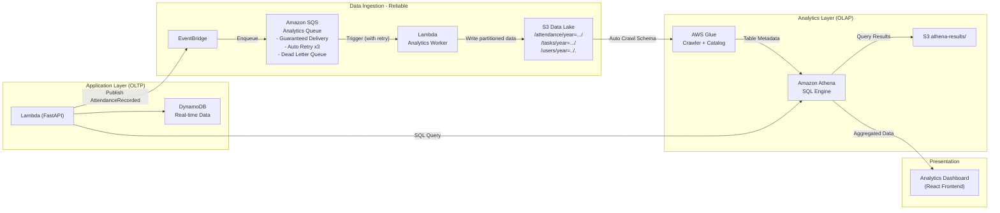

## Overview

In this step, you will build a **Enterprise-Grade Analytics Pipeline** on AWS to store and analyze attendance, tasks, leaves, and events data. This implements **Workflow 5 (WF5) - Enterprise Analytics & Reporting** from the Smart Campus system.

Using:
- **S3**: Data Lake storage with partitioning by date (year/month/day)
- **AWS Glue Crawler**: Auto discover schema (3 tables: attendance, tasks, users)
- **Amazon Athena**: SQL queries on S3 data for OLAP analytics
- **Kinesis Data Firehose**: High-throughput streaming to Data Lake (optional advanced)

## Why Data Lake? (Hybrid OLTP + OLAP Architecture)

**DynamoDB limitations (OLTP):**
- ❌ No complex analytics queries (no JOIN, complex GROUP BY)
- ❌ Expensive for large dataset scans (read capacity costs)
- ❌ Limited to key-based access patterns

**S3 Data Lake advantages (OLAP):**
- ✅ Cheap storage ($0.023/GB/month)
- ✅ Analytics at scale (petabytes)
- ✅ Query with Athena (standard SQL)
- ✅ Integrate with BI tools (QuickSight, Tableau)
- ✅ Decouples analytics from transactional DB

**Smart Campus Hybrid Approach:**
- **Phase 1 (DynamoDB Direct)**: Real-time queries for recent data (< 14 days) - low latency
- **Phase 2 (Athena/S3 Data Lake)**: Historical/Big Data queries - cost-effective for large scans
- **Auto-fallback**: If Athena fails, automatically falls back to DynamoDB

## Data Lake Architecture



## Step 1: Create S3 Data Lake Bucket

```bash
# Create bucket
aws s3 mb s3://smart-campus-datalake-${AWS_ACCOUNT_ID} \
  --region ap-southeast-1

# Enable versioning
aws s3api put-bucket-versioning \
  --bucket smart-campus-datalake-${AWS_ACCOUNT_ID} \
  --versioning-configuration Status=Enabled \
  --region ap-southeast-1

# Enable encryption
aws s3api put-bucket-encryption \
  --bucket smart-campus-datalake-${AWS_ACCOUNT_ID} \
  --server-side-encryption-configuration '{
    "Rules": [{
      "ApplyServerSideEncryptionByDefault": {
        "SSEAlgorithm": "AES256"
      }
    }]
  }' \
  --region ap-southeast-1
```

**Create folder structure (partitioned by entity):**
```bash
# Create prefix (folders) for each entity
aws s3api put-object \
  --bucket smart-campus-datalake-${AWS_ACCOUNT_ID} \
  --key attendance/ \
  --region ap-southeast-1

aws s3api put-object \
  --bucket smart-campus-datalake-${AWS_ACCOUNT_ID} \
  --key tasks/ \
  --region ap-southeast-1

aws s3api put-object \
  --bucket smart-campus-datalake-${AWS_ACCOUNT_ID} \
  --key users/ \
  --region ap-southeast-1

aws s3api put-object \
  --bucket smart-campus-datalake-${AWS_ACCOUNT_ID} \
  --key leaves/ \
  --region ap-southeast-1

aws s3api put-object \
  --bucket smart-campus-datalake-${AWS_ACCOUNT_ID} \
  --key events/ \
  --region ap-southeast-1

aws s3api put-object \
  --bucket smart-campus-datalake-${AWS_ACCOUNT_ID} \
  --key athena-results/ \
  --region ap-southeast-1
```

## Step 2: Setup Lifecycle Policy (Cost Optimization)

**Auto transition data to Glacier after 90 days, delete Athena results after 7 days:**

```bash
cat > lifecycle-policy.json <<EOF
{
  "Rules": [
    {
      "Id": "TransitionToGlacier",
      "Status": "Enabled",
      "Filter": {
        "Prefix": "attendance/"
      },
      "Transitions": [
        {
          "Days": 90,
          "StorageClass": "GLACIER"
        }
      ]
    },
    {
      "Id": "TransitionTasksToGlacier",
      "Status": "Enabled",
      "Filter": {
        "Prefix": "tasks/"
      },
      "Transitions": [
        {
          "Days": 90,
          "StorageClass": "GLACIER"
        }
      ]
    },
    {
      "Id": "DeleteOldAthenaResults",
      "Status": "Enabled",
      "Filter": {
        "Prefix": "athena-results/"
      },
      "Expiration": {
        "Days": 7
      }
    }
  ]
}
EOF

aws s3api put-bucket-lifecycle-configuration \
  --bucket smart-campus-datalake-${AWS_ACCOUNT_ID} \
  --lifecycle-configuration file://lifecycle-policy.json \
  --region ap-southeast-1
```

## Step 3: Verify Analytics Worker Writing Data (Kinesis Firehose Integration)

**The Analytics Worker uses Kinesis Data Firehose for high-throughput streaming:**

```python
# app/workers/analytics_worker.py
import boto3
import json
from datetime import datetime

firehose = boto3.client('firehose', region_name='ap-southeast-1')
DATA_LAKE_BUCKET = 'smart-campus-datalake-xxxxxxxxxxxx'

def handler(event, context):
    """
    Process events from SQS Analytics Queue
    Streams to S3 Data Lake via Kinesis Firehose
    """
    for record in event['Records']:
        body = json.loads(record['body'])
        detail = body.get('detail', {})
        event_type = body.get('detail-type', 'Unknown')
        
        # Extract date for partitioning
        timestamp = detail.get('timestamp', datetime.utcnow().isoformat())
        date = timestamp[:10]  # YYYY-MM-DD
        year, month, day = date.split('-')
        
        # Determine prefix based on event type
        if 'Attendance' in event_type:
            prefix = f'attendance/year={year}/month={month}/day={day}/'
        elif 'Task' in event_type:
            prefix = f'tasks/year={year}/month={month}/day={day}/'
        elif 'User' in event_type:
            prefix = f'users/year={year}/month={month}/day={day}/'
        else:
            prefix = f'events/year={year}/month={month}/day={day}/'
        
        # Add partition keys to record for Firehose
        detail['partition_year'] = year
        detail['partition_month'] = month
        detail['partition_day'] = day
        
        # Send to Firehose (batches automatically)
        firehose.put_record(
            DeliveryStreamName='smart-campus-attendance-stream',
            Record={'Data': json.dumps(detail) + '\n'}
        )
    
    return {'statusCode': 200, 'body': f'Processed {len(event["Records"])} records'}
```

**Kinesis Firehose Delivery Stream Configuration:**
- **DeliveryStreamName**: `smart-campus-attendance-stream`
- **Destination**: S3 (smart-campus-datalake bucket)
- **Buffer hints**: 60 seconds or 5 MB
- **Compression**: GZIP
- **Prefix**: `attendance/year=!{timestamp:yyyy}/month=!{timestamp:MM}/day=!{timestamp:dd}/`

**Test write manually:**
```bash
# Create test data
cat > test-attendance.json <<EOF
{
  "attendance_id": "att-test-001",
  "user_id": "user-001",
  "user_name": "Nguyen Van A",
  "status": "PRESENT",
  "session_type": "MORNING",
  "timestamp": "2026-08-06T07:55:00+07:00",
  "camera_id": "camera-01",
  "confidence": 98.5
}
EOF

# Upload to S3 with partitioning (simulating Firehose output)
aws s3 cp test-attendance.json \
  s3://smart-campus-datalake-${AWS_ACCOUNT_ID}/attendance/year=2026/month=08/day=06/att-test-001.json \
  --region ap-southeast-1
```

**Verify:**
```bash
aws s3 ls s3://smart-campus-datalake-${AWS_ACCOUNT_ID}/attendance/year=2026/month=08/day=06/ --recursive
```

## Step 4: Create IAM Role for Glue Crawler

```bash
# Create trust policy
cat > glue-trust-policy.json <<EOF
{
  "Version": "2012-10-17",
  "Statement": [{
    "Effect": "Allow",
    "Principal": {
      "Service": "glue.amazonaws.com"
    },
    "Action": "sts:AssumeRole"
  }]
}
EOF

# Create role
aws iam create-role \
  --role-name SmartCampusGlueCrawlerRole \
  --assume-role-policy-document file://glue-trust-policy.json \
  --description "Role for Glue Crawler to access S3 Data Lake"

# Attach AWS managed policy
aws iam attach-role-policy \
  --role-name SmartCampusGlueCrawlerRole \
  --policy-arn arn:aws:iam::aws:policy/service-role/AWSGlueServiceRole

# Create inline policy for S3 access
cat > glue-s3-policy.json <<EOF
{
  "Version": "2012-10-17",
  "Statement": [{
    "Effect": "Allow",
    "Action": [
      "s3:GetObject",
      "s3:PutObject",
      "s3:ListBucket"
    ],
    "Resource": [
      "arn:aws:s3:::smart-campus-datalake-${AWS_ACCOUNT_ID}",
      "arn:aws:s3:::smart-campus-datalake-${AWS_ACCOUNT_ID}/*"
    ]
  }]
}
EOF

aws iam put-role-policy \
  --role-name SmartCampusGlueCrawlerRole \
  --policy-name S3DataLakeAccess \
  --policy-document file://glue-s3-policy.json
```

## Step 5: Create Glue Database

```bash
aws glue create-database \
  --database-input '{
    "Name": "smart_campus_db",
    "Description": "Smart Campus Data Lake - Attendance, Tasks, Users"
  }' \
  --region ap-southeast-1
```

**Verify:**
```bash
aws glue get-database \
  --name smart_campus_db \
  --region ap-southeast-1
```

## Step 6: Create Glue Crawlers (3 Tables)

**Crawler 1: Attendance Data**
```bash
aws glue create-crawler \
  --name smart-campus-attendance-crawler \
  --role arn:aws:iam::${AWS_ACCOUNT_ID}:role/SmartCampusGlueCrawlerRole \
  --database-name smart_campus_db \
  --targets '{
    "S3Targets": [{
      "Path": "s3://smart-campus-datalake-'${AWS_ACCOUNT_ID}'/attendance/"
    }]
  }' \
  --schema-change-policy '{
    "UpdateBehavior": "UPDATE_IN_DATABASE",
    "DeleteBehavior": "LOG"
  }' \
  --configuration "{\"Version\":1.0,\"CrawlerOutput\":{\"Partitions\":{\"AddOrUpdateBehavior\":\"InheritFromTable\"}}}" \
  --region ap-southeast-1
```

**Crawler 2: Tasks Data**
```bash
aws glue create-crawler \
  --name smart-campus-tasks-crawler \
  --role arn:aws:iam::${AWS_ACCOUNT_ID}:role/SmartCampusGlueCrawlerRole \
  --database-name smart_campus_db \
  --targets '{
    "S3Targets": [{
      "Path": "s3://smart-campus-datalake-'${AWS_ACCOUNT_ID}'/tasks/"
    }]
  }' \
  --region ap-southeast-1
```

**Crawler 3: Users Data**
```bash
aws glue create-crawler \
  --name smart-campus-users-crawler \
  --role arn:aws:iam::${AWS_ACCOUNT_ID}:role/SmartCampusGlueCrawlerRole \
  --database-name smart_campus_db \
  --targets '{
    "S3Targets": [{
      "Path": "s3://smart-campus-datalake-'${AWS_ACCOUNT_ID}'/users/"
    }]
  }' \
  --region ap-southeast-1
```

## Step 7: Run Crawlers

```bash
# Start all crawlers
aws glue start-crawler --name smart-campus-attendance-crawler --region ap-southeast-1
aws glue start-crawler --name smart-campus-tasks-crawler --region ap-southeast-1
aws glue start-crawler --name smart-campus-users-crawler --region ap-southeast-1

# Check status (wait 1-2 minutes)
for CRAWLER in smart-campus-attendance-crawler smart-campus-tasks-crawler smart-campus-users-crawler; do
  while true; do
    STATE=$(aws glue get-crawler --name $CRAWLER --region ap-southeast-1 --query 'Crawler.State' --output text)
    if [ "$STATE" = "READY" ]; then
      echo "✅ $CRAWLER finished!"
      break
    fi
    echo "$CRAWLER state: $STATE, waiting..."
    sleep 10
  done
done
```

**Check created tables:**
```bash
aws glue get-tables --database-name smart_campus_db --region ap-southeast-1
```

Expected: 3 tables (attendance, tasks, users) with schema auto-discovered from JSON files.

## Step 8: Query Data with Athena

**Setup Athena Workgroup with output location:**
```bash
aws athena create-work-group \
  --name smart-campus-workgroup \
  --configuration "ResultConfigurationUpdates={OutputLocation=s3://smart-campus-datalake-${AWS_ACCOUNT_ID}/athena-results/}" \
  --region ap-southeast-1
```

**Query 1: Attendance Summary (Daily)**
```sql
SELECT 
  COUNT(*) as total_attendance,
  status,
  session_type
FROM attendance
WHERE year = '2026' 
  AND month = '08' 
  AND day = '06'
GROUP BY status, session_type
ORDER BY session_type, status
```

**Query 2: Attendance Trend (Last 30 Days)**
```sql
SELECT 
  date,
  COUNT(*) as total,
  SUM(CASE WHEN status = 'PRESENT' THEN 1 ELSE 0 END) as present,
  SUM(CASE WHEN status = 'LATE' THEN 1 ELSE 0 END) as late,
  SUM(CASE WHEN status = 'ABSENT' THEN 1 ELSE 0 END) as absent
FROM attendance
WHERE year = '2026' AND month = '08'
GROUP BY date
ORDER BY date
```

**Query 3: Department Comparison Matrix (Enterprise Analytics)**
```sql
SELECT 
  u.department,
  COUNT(DISTINCT u.user_id) as total_users,
  ROUND(
    SUM(CASE WHEN a.status = 'PRESENT' THEN 1 ELSE 0 END) * 100.0 / 
    COUNT(*), 1
  ) as punctuality_rate,
  SUM(CASE WHEN a.status = 'LATE' THEN 1 ELSE 0 END) as late_count,
  SUM(CASE WHEN a.status = 'ABSENT' THEN 1 ELSE 0 END) as absent_count
FROM attendance a
JOIN users u ON a.user_id = u.user_id
WHERE a.year = '2026' AND a.month = '08'
GROUP BY u.department
ORDER BY punctuality_rate DESC
```

**Query 4: Task Workload Analytics (WF8 Integration)**
```sql
SELECT 
  u.department,
  u.full_name,
  COUNT(t.task_id) as total_assigned,
  SUM(CASE WHEN t.status = 'DONE' THEN 1 ELSE 0 END) as completed,
  ROUND(
    SUM(CASE WHEN t.status = 'DONE' THEN 1 ELSE 0 END) * 100.0 / 
    COUNT(t.task_id), 1
  ) as completion_rate,
  SUM(CASE WHEN t.due_date < CURRENT_DATE AND t.status != 'DONE' THEN 1 ELSE 0 END) as overdue
FROM tasks t
JOIN users u ON t.assignee_id = u.user_id
WHERE t.created_at >= '2026-08-01'
GROUP BY u.department, u.full_name
ORDER BY total_assigned DESC
```

**Execute via CLI:**
```bash
QUERY_ID=$(aws athena start-query-execution \
  --query-string "SELECT COUNT(*) as total FROM attendance WHERE year='2026' AND month='08' AND day='06'" \
  --query-execution-context Database=smart_campus_db \
  --result-configuration OutputLocation=s3://smart-campus-datalake-${AWS_ACCOUNT_ID}/athena-results/ \
  --work-group smart-campus-workgroup \
  --region ap-southeast-1 \
  --query 'QueryExecutionId' \
  --output text)

echo "Query ID: ${QUERY_ID}"
```

**Wait for query completion:**
```bash
aws athena get-query-execution \
  --query-execution-id ${QUERY_ID} \
  --region ap-southeast-1 \
  --query 'QueryExecution.Status.State' \
  --output text
```

**Get results:**
```bash
aws athena get-query-results \
  --query-execution-id ${QUERY_ID} \
  --region ap-southeast-1
```

## Step 9: Backend Integration - Dual Engine Query

**The Reports module uses a dual-engine approach (app/modules/reports/repository.py):**

```python
# Phase 1: Try Athena for big data queries
# Phase 2: Fallback to DynamoDB for real-time/recent data

async def get_trend_records(self, start_date: str, end_date: str, department: str = None):
    # Try Athena first (for historical data > 14 days)
    if self.athena_enabled and (datetime.now() - parse_date(start_date)).days > 14:
        try:
            return await self._query_athena_trend(start_date, end_date, department)
        except Exception as e:
            logger.warning(f"Athena query failed, falling back to DynamoDB: {e}")
    
    # Fallback to DynamoDB (real-time, recent data)
    return await self._query_dynamodb_trend(start_date, end_date, department)

async def get_report_summary(self, period_start: str, period_end: str, department: str = None):
    # Single-pass loop optimization (fixes N×M DynamoDB reads)
    records = await self.get_trend_records(period_start, period_end, department)
    
    # Aggregate in memory - single pass
    summary = {
        'total_users': set(),
        'present': 0, 'late': 0, 'absent': 0,
        'by_session': {'MORNING': 0, 'AFTERNOON': 0, 'EVENING': 0}
    }
    
    for r in records:
        user_id = r.get('userId') or r.get('user_id')
        summary['total_users'].add(user_id)
        summary[r['status']] += 1
        summary['by_session'][r.get('session_type', 'MORNING')] += 1
    
    return {
        'total_users': len(summary['total_users']),
        'punctuality_rate': round(summary['present'] / max(sum(summary.values()), 1) * 100, 1),
        'by_status': {k: v for k, v in summary.items() if k in ['present', 'late', 'absent']},
        'by_session': summary['by_session']
    }
```

## Enterprise Analytics Features (WF5 Upgrade)

### RBAC-Based Analytics Access

| Role | View Scope | Features |
|:---|:---|:---|
| **PO/Director/Admin** | Global (All Departments) | Department Comparison Matrix, Cross-department analytics, Full export |
| **PM/Department Manager** | Department-scoped | Department KPIs, Team workload, Top late/absent in dept, Dept export |
| **STAFF/Employee** | Personal (Self-service) | My attendance, My task workload, My KPIs, Personal export only |

### Key KPIs Calculated

1. **Punctuality Rate**: `PRESENT / (PRESENT + LATE + ABSENT) × 100`
2. **Tardiness Index**: `LATE / Total × 100` (Alert if > 15%)
3. **Absenteeism Rate**: `ABSENT / Total × 100`
4. **Task Completion Rate**: `DONE / Total Assigned × 100`
5. **MTTR (Mean Time To Repair)**: Avg time from OPEN to DONE for MAINTENANCE tasks

### Automated Anomaly Alerts

- **Consecutive Late**: 3+ days late → Alert to Manager
- **Dept Performance Drop**: Completion rate < 70% → Alert to Director
- **Security Anomaly**: Unknown Face spike > 10x/day → Security alert

### Automated Email Digests

- **Weekly Department Digest**: Monday 08:00 to PMs
- **Monthly Executive Summary**: 1st of month to Directors

## Next Step

Proceed to [Testing the System](../5.9-testing) to verify the end-to-end analytics pipeline!

**Get results:**
```bash
aws athena get-query-results \
  --query-execution-id ${QUERY_ID} \
  --region ap-southeast-1
```

**Query 2: Late attendance rate**

```sql
SELECT 
  DATE(from_iso8601_timestamp(timestamp)) as date,
  COUNT(CASE WHEN status = 'LATE' THEN 1 END) * 100.0 / COUNT(*) as late_rate
FROM attendance
WHERE year = '2026' AND month = '08'
GROUP BY DATE(from_iso8601_timestamp(timestamp))
ORDER BY date DESC
```

**Query 3: User attendance history**

```sql
SELECT 
  user_id,
  user_name,
  status,
  session_type,
  from_iso8601_timestamp(timestamp) as attendance_time,
  confidence
FROM attendance
WHERE user_id = 'user-001'
  AND year = '2026'
  AND month = '08'
ORDER BY timestamp DESC
LIMIT 30
```

**Query 4: Department-level analytics**

```sql
SELECT 
  SUBSTR(user_id, 1, 3) as department,  -- e.g., 'ENG', 'MKT'
  COUNT(*) as total_attendance,
  AVG(CASE WHEN status = 'PRESENT' THEN 1.0 ELSE 0.0 END) as present_rate,
  AVG(CASE WHEN status = 'LATE' THEN 1.0 ELSE 0.0 END) as late_rate
FROM attendance
WHERE year = '2026' AND month = '08'
GROUP BY SUBSTR(user_id, 1, 3)
ORDER BY present_rate DESC
```

## Step 9: Schedule Crawler (Auto Update Schema)

**Create EventBridge rule to run crawler daily:**

```bash
aws events put-rule \
  --name daily-crawler-schedule \
  --schedule-expression "cron(0 2 * * ? *)" \
  --state ENABLED \
  --description "Run Glue Crawler daily at 2 AM UTC" \
  --region ap-southeast-1

# Add target
aws events put-targets \
  --rule daily-crawler-schedule \
  --targets "Id"="1","Arn"="arn:aws:glue:ap-southeast-1:${AWS_ACCOUNT_ID}:crawler/smart-campus-attendance-crawler","RoleArn"="arn:aws:iam::${AWS_ACCOUNT_ID}:role/service-role/Amazon_EventBridge_Invoke_Glue_Crawler" \
  --region ap-southeast-1
```

**Create IAM role for EventBridge:**
```bash
cat > eventbridge-glue-trust.json <<EOF
{
  "Version": "2012-10-17",
  "Statement": [{
    "Effect": "Allow",
    "Principal": {
      "Service": "events.amazonaws.com"
    },
    "Action": "sts:AssumeRole"
  }]
}
EOF

aws iam create-role \
  --role-name Amazon_EventBridge_Invoke_Glue_Crawler \
  --assume-role-policy-document file://eventbridge-glue-trust.json \
  --path /service-role/

cat > eventbridge-glue-policy.json <<EOF
{
  "Version": "2012-10-17",
  "Statement": [{
    "Effect": "Allow",
    "Action": "glue:StartCrawler",
    "Resource": "*"
  }]
}
EOF

aws iam put-role-policy \
  --role-name Amazon_EventBridge_Invoke_Glue_Crawler \
  --policy-name GlueCrawlerAccess \
  --policy-document file://eventbridge-glue-policy.json
```

## Step 10: Create Athena Views (Reusable Queries)

**View 1: Daily attendance summary**

```sql
CREATE OR REPLACE VIEW v_daily_attendance_summary AS
SELECT 
  year || '-' || month || '-' || day as date,
  session_type,
  COUNT(*) as total,
  COUNT(CASE WHEN status = 'PRESENT' THEN 1 END) as present,
  COUNT(CASE WHEN status = 'LATE' THEN 1 END) as late,
  COUNT(CASE WHEN status = 'ABSENT' THEN 1 END) as absent
FROM attendance
GROUP BY year, month, day, session_type
```

**Execute:**
```bash
aws athena start-query-execution \
  --query-string "$(cat create-view-daily-summary.sql)" \
  --query-execution-context Database=smart_campus_db \
  --result-configuration OutputLocation=s3://smart-campus-datalake-${AWS_ACCOUNT_ID}/athena-results/ \
  --region ap-southeast-1
```

**Query view:**
```sql
SELECT * FROM v_daily_attendance_summary
WHERE date >= '2026-08-01'
ORDER BY date DESC, session_type
```

## Monitoring and Optimization

**Athena query performance tips:**

1. **Partition pruning:** Always filter by year/month/day
```sql
-- Good (scans only 1 day)
WHERE year='2026' AND month='08' AND day='06'

-- Bad (scans entire dataset)
WHERE timestamp LIKE '2026-08-06%'
```

2. **Columnar format:** Convert JSON → Parquet (10x faster, 90% smaller)
```sql
CREATE TABLE attendance_parquet
WITH (
  format = 'PARQUET',
  parquet_compression = 'SNAPPY',
  partitioned_by = ARRAY['year', 'month', 'day']
) AS
SELECT * FROM attendance
```

3. **Compression:** Gzip JSON files before upload
```bash
gzip attendance-records.json
aws s3 cp attendance-records.json.gz s3://...
```

**Monitor Athena costs:**
```bash
aws athena get-query-execution \
  --query-execution-id ${QUERY_ID} \
  --query 'QueryExecution.Statistics.DataScannedInBytes' \
  --output text
```

Athena pricing: $5 per TB scanned

## Cost Estimation

**Monthly costs (10K attendance/day × 30 days = 300K records):**

- **S3 storage:** 300K × 2KB = 600MB = $0.014/month
- **Athena queries:** 10 queries/day × 600MB scan = $0.0003/query = $0.09/month
- **Glue Crawler:** Daily run × 0.5 DPU-hour = $0.44 × 30 = $13.20/month

**Total: ~$13.33/month**

**Optimization:**
- Run crawler weekly instead of daily → $1.76/month
- Use Parquet → Reduce scan by 90% → $0.009/month
- **Optimized total: ~$2/month**

## Troubleshooting

**Issue: Crawler doesn't find files**
- Check S3 path correct
- Check IAM role has S3 permissions
- Verify at least 1 file exists in path

**Issue: Schema mismatch**
- Delete table: `DROP TABLE attendance`
- Re-run crawler with fresh schema

**Issue: Query slow**
- Add partition filters (year/month/day)
- Convert to Parquet format
- Limit results with LIMIT clause

**Issue: Query error "HIVE_PARTITION_SCHEMA_MISMATCH"**
- Schema changed between partitions
- Solution: Re-crawl all or drop & recreate table

## Verify Setup

Checklist:
- [ ] S3 Data Lake bucket created
- [ ] Lifecycle policy configured
- [ ] Glue database created
- [ ] Glue crawler created and ran successfully
- [ ] Athena queries return data
- [ ] Partitioning working (query performance good)
- [ ] Scheduled crawler enabled

## Next Step

Proceed to [Step 9: Testing the System](../5.9-testing) to verify the entire workflow!